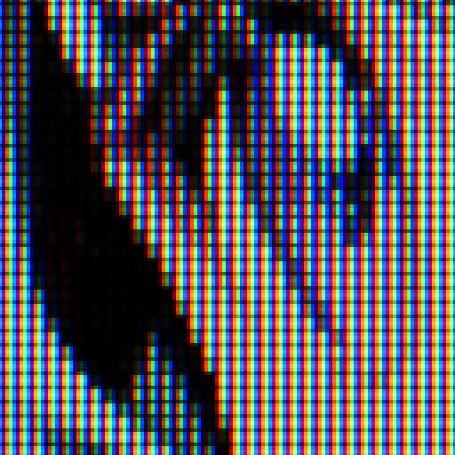
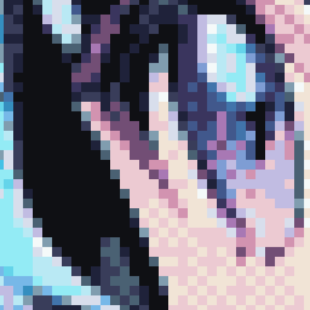
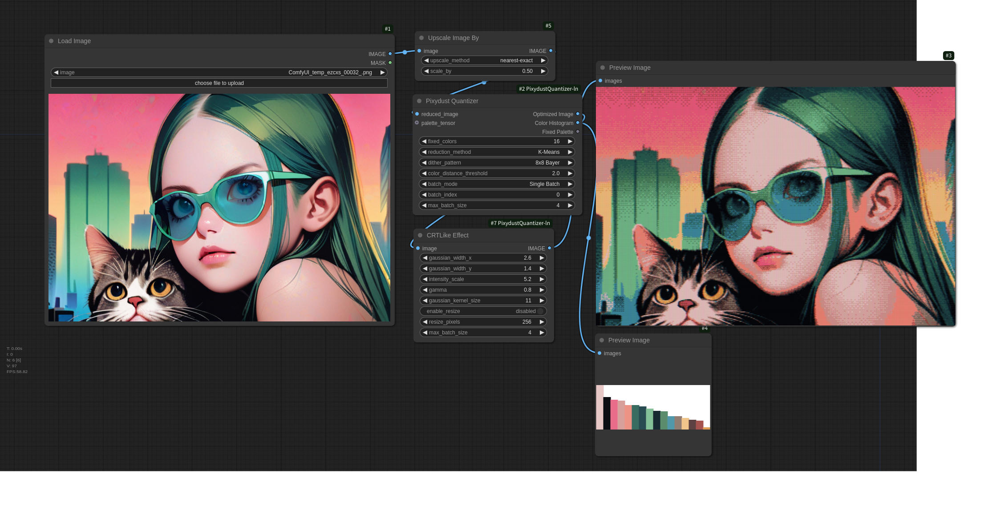

# Pixydust Quantizer for ComfyUI

Pixydust Quantizer is a custom node extension for ComfyUI that allows for the simplified recreation of tile patterns used in 1990s 16-color PC graphics, offering advanced color quantization and palette optimization features.
Additionally, it includes a CRT-like effect node that mimics the phosphor glow and slight color bleeding of old CRT displays, adding a nostalgic aesthetic.
With version 2.0.0, it now supports batch image processing, enabling efficient handling of video frames and image sequences.

- Original


- Pixydust Quantizer


- Regular tool  (ImageQuantize)


- CRT Effect Sample Image




- Quantize and CRT Effect Sample Video


## Features and Concept

- Simplified recreation of tile patterns used in 1990s 16-color PC graphics
- Prioritizes colors used in large areas of the image (e.g., a character's face) for the palette, preventing unnecessary tile patterning
- Threshold settings to adjust the balance between tile patterns and flat colors
- External palette input function to maintain palette consistency in videos or image sequences
- Control over which colors are tile-patterned, which was difficult with traditional methods
- CRT-like effect node that simulates phosphor glow and pixel-level color bleeding to enhance the characteristic gradation of pixel art

The name "Pixydust" combines "pixy" (as in pixel art) and "dust" (to suggest a grainy look), with an added nuance of a clever, tricky effect, like the magic of fairy dust.

## Installation

1. Navigate to the custom node directory in ComfyUI:
   ```
   cd ComfyUI/custom_nodes/
   ```

2. Clone this repository:
   ```
   git clone https://github.com/yourusername/ComfyUI-Pixydust-Quantizer.git
   ```

3. Install the required dependencies:
   ```
   pip install -r ComfyUI-Pixydust-Quantizer/requirements.txt
   ```

4. Restart ComfyUI

## Usage

### Pixydust Quantizer (Color Reduction and Optimization Node)
This node provides comprehensive color reduction and optimization in a single step, streamlining the process that previously required two separate nodes. It handles both initial color reduction and subsequent palette optimization with dithering.
Inputs:

- image: Input image or batch of images
- color_reduction_method: Choose from "K-Means" or "MedianCut"
- max_colors: Maximum number of colors for initial reduction ([2,4,8,16,32,64,96,128,192,256])
- fixed_colors: Number of colors in the optimized palette ([2,4,6,8,12,16,24,32,64,96,128,192,256])
- dither_pattern: Choose from "None", "2x2 Bayer", "4x4 Bayer", or "8x8 Bayer"
- color_distance_threshold: Threshold for using tile patterns (0.0 to 10.0)
- batch_mode: Choose between "All Batches" or "Single Batch"
- batch_index: Select specific batch index when in "Single Batch" mode
- max_batch_size: Control memory usage by setting maximum images to process at once
- palette_tensor (optional): External palette input for maintaining consistency across images

Outputs:

- Optimized Image: Final image(s) with optimized palette and dithering applied
- Color Histogram: Visual representation of color distribution
- Fixed Palette: Optimized color palette in tensor format

Batch Processing Features

- Supports processing of image sequences or video frames as batch inputs
- Maintains consistent palette across all frames when using external palette input
- Process entire batches at once while managing memory efficiently with max_batch_size
- Option to process individual frames using "Single Batch" mode
- Output can be directly used for video creation by combining the processed frames
- Preserves batch structure in output, making it compatible with video export workflows

### CRTLikeEffect (CRT Simulation Node)

This node applies a CRT-like effect to the input image to replicate the appearance of classic CRT monitors. The node adds phosphor glow and subtle color bleed, with independent control over the RGB bleed amount in the X and Y directions. It also provides adjustable gamma and intensity settings for fine-tuning the effect and achieving a retro aesthetic.

Inputs:
- `image`: Input image
- `gaussian_width_x`: Horizontal blur width (0.1 to 3.0, default: 1.0)
- `gaussian_width_y`: Vertical blur width (0.1 to 3.0, default: 1.0)
- `intensity_scale`: Overall effect intensity (0.1 to 10.0, default: 1.2)
- `gamma`: Gamma correction value (0.1 to 5.0, default: 2.2)
- `gaussian_kernel_size`: Size of the Gaussian kernel (5, 7, 9, 11, 13, or 15, default: 11)
- `enable_resize`: Enable/disable image resizing (default: enabled)
- `resize_pixels`: Target size for resizing (128 to 512 pixels, default: 256)

Outputs:
- `IMAGE`: Processed image with CRT-like effects applied

Note: The output image dimensions are 4x larger than the input (both width and height are quadrupled to simulate the CRT subpixel pattern)

## Example Workflow

1. Basic Image Processing:
   1. Load an image or batch of images
   2. Connect to the Pixydust Quantizer node
   3. Adjust parameters for desired retro appearance
   4. Save or display the resulting optimized image(s)

2. CRT-Like Effect Step:
   1. Connect any image to the "image" input of the CRTLike Effect node 
      - Can use either a quantized image from previous step or any other image source
   2. The node's IMAGE output provides the processed result with CRT-like effects applied
      - Simulates the appearance of old CRT displays
      - Adjustable parameters for fine-tuning the effect



## Tips

### How to Fix Palette Using First Frame for Video Processing

To maintain consistent colors across all frames by using the palette generated from the first frame:

1. Place two Pixydust Quantizer nodes in your workflow:
   - Set the first node's `batch_mode` to "Single Batch" (this will process only the first frame)
   - Set the second node's `batch_mode` to "All Batches" (this will process all frames)

2. Load your video:
   - Use a video loading node like VideoHelperSuite's "Load Video" node
   - Connect the video output to both Pixydust Quantizer nodes' `image` input

3. Connect the nodes:
   - Connect the `Fixed Palette` output from the first Pixydust Quantizer to the `palette_tensor` input of the second Pixydust Quantizer.

4. Process the batch images:
   - The second Pixydust Quantizer will output a batch of processed frames
   - All frames will use the palette generated from the first frame
   - This ensures color consistency throughout the video

## Changelog
- 1.0.0 (2024-10-20): Initial release
- 1.1.0 (2024-10-27): Added support for GPU processing and implemented the CRTLikeEffect node
- 2.0.0 (2024-11-3): Added support for batch images

## License

This project is licensed under the MIT License - see the [LICENSE](LICENCE.txt) file for details.

## Acknowledgments

- Special thanks to the ComfyUI community for providing the tools and creative motivation!