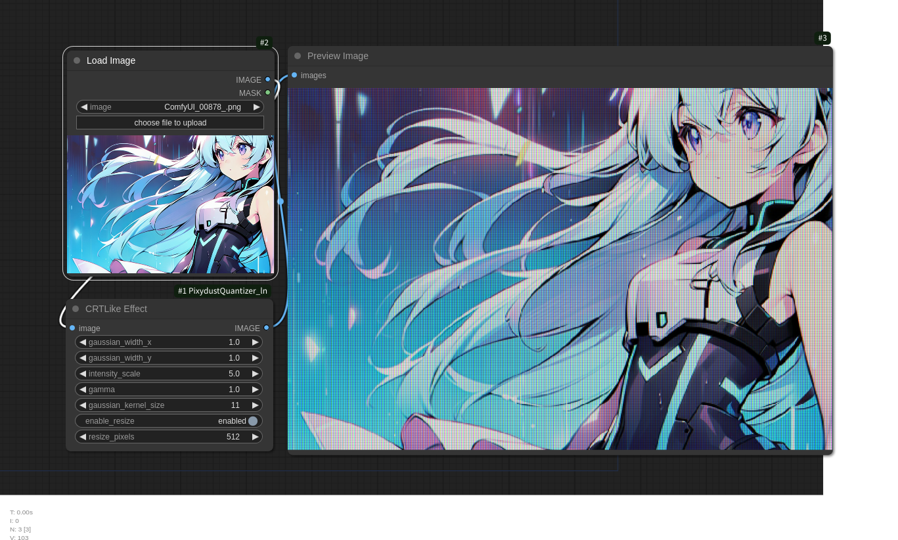

# Pixydust Quantizer for ComfyUI

Pixydust Quantizer is a custom node extension for ComfyUI that allows for the simplified recreation of tile patterns used in 1990s 16-color PC graphics, offering advanced color quantization and palette optimization features.
Additionally, it includes a CRT-like effect node that mimics the phosphor glow and slight color bleeding of old CRT displays, adding a nostalgic aesthetic.

- Original


- Pixydust Quantizer


- Regular tool  (ImageQuantize)


- CRT Effect Sample Image


## Features and Concept

- Simplified recreation of tile patterns used in 1990s 16-color PC graphics
- Prioritizes colors used in large areas of the image (e.g., a character's face) for the palette, preventing unnecessary tile patterning
- Threshold settings to adjust the balance between tile patterns and flat colors
- External palette input function to maintain palette consistency in videos or image sequences
- Control over which colors are tile-patterned, which was difficult with traditional methods
- CRT-like effect node that simulates phosphor glow and pixel-level color bleeding to enhance the characteristic gradation of pixel art

The name "Pixydust" combines "pixy" (as in pixel art) and "dust" (to suggest a grainy look), with an added nuance of a clever, tricky effect, like the magic of fairy dust.

## Installation

1. Navigate to the custom node directory in ComfyUI:
   ```
   cd ComfyUI/custom_nodes/
   ```

2. Clone this repository:
   ```
   git clone https://github.com/yourusername/ComfyUI-Pixydust-Quantizer.git
   ```

3. Install the required dependencies:
   ```
   pip install -r ComfyUI-Pixydust-Quantizer/requirements.txt
   ```

4. Restart ComfyUI

## Usage

### PixydustQuantize1 (Primary Color Reduction Node)

This node reduces the colors of an input image using the specified method and maximum number of colors.

Inputs:
- `image`: Input image
- `color_reduction_method`: Choose from "Pillow Quantize", "K-Means", or "MedianCut"
- `max_colors`: Maximum number of colors after reduction

Outputs:
- `Reduced Color Image`: Image with reduced colors
- `Palette Preview`: Preview of the color palette used
- `Palette Tensor`: Color palette in tensor format

### PixydustQuantize2 (Palette Optimization Node)

This node optimizes the palette of a color-reduced image and applies dithering. It assigns palette colors based on the proportion of each color used in the image to avoid tile patterning in prominent areas like a character’s face.

Inputs:
- `reduced_image`: Input image with reduced colors
- `fixed_colors`: Number of colors in the optimized palette
- `reduction_method`: Choose from "K-Means" or "MedianCut"
- `dither_pattern`: Choose from "None", "2x2 Bayer", "4x4 Bayer", or "8x8 Bayer"
- `color_distance_threshold`: Threshold for using tile patterns
- `palette_tensor` (optional): External palette input for videos

Outputs:
- `Optimized Image`: Image with optimized palette and dithering applied
- `Color Histogram`: Color histogram of the optimized image
- `Fixed Palette`: Optimized color palette in tensor format

### CRTLikeEffect (CRT Simulation Node)

This node applies a CRT-like effect to the input image to replicate the appearance of classic CRT monitors. The node adds phosphor glow and subtle color bleed, with independent control over the RGB bleed amount in the X and Y directions. It also provides adjustable gamma and intensity settings for fine-tuning the effect and achieving a retro aesthetic.

Inputs:
- `image`: Input image
- `gaussian_width_x`: Horizontal blur width (0.1 to 3.0, default: 1.0)
- `gaussian_width_y`: Vertical blur width (0.1 to 3.0, default: 1.0)
- `intensity_scale`: Overall effect intensity (0.1 to 10.0, default: 1.2)
- `gamma`: Gamma correction value (0.1 to 5.0, default: 2.2)
- `gaussian_kernel_size`: Size of the Gaussian kernel (5, 7, 9, 11, 13, or 15, default: 11)
- `enable_resize`: Enable/disable image resizing (default: enabled)
- `resize_pixels`: Target size for resizing (128 to 512 pixels, default: 256)

Outputs:
- `IMAGE`: Processed image with CRT-like effects applied

Note: The output image dimensions are 4x larger than the input (both width and height are quadrupled to simulate the CRT subpixel pattern)

## Example Workflow

1. Color Quantization Step:
   1. Load an image
   2. Connect the image to the Pixydust Quantize-1
   3. Connect the output of the ColorReducerNode to the Pixydust Quantize-2
   4. Save or display the resulting optimized image

2. CRT-Like Effect Step:
   1. Connect any image to the "image" input of the CRTLike Effect node 
      - Can use either a quantized image from previous step or any other image source
   2. The node's IMAGE output provides the processed result with CRT-like effects applied
      - Simulates the appearance of old CRT displays
      - Adjustable parameters for fine-tuning the effect

Note: The processing speed isn't very fast so far. It takes about 10 seconds (depending on the machine's power) to generate a 512x512 pixel image.




## Changelog
- 1.0.0 (2024-10-20): Initial release
- 1.1.0 (2024-10-27): Added support for GPU processing and implemented the CRTLikeEffect node

## License

This project is licensed under the MIT License - see the [LICENSE](LICENCE.txt) file for details.

## Acknowledgments

- Special thanks to the ComfyUI community for providing the tools and creative motivation!
