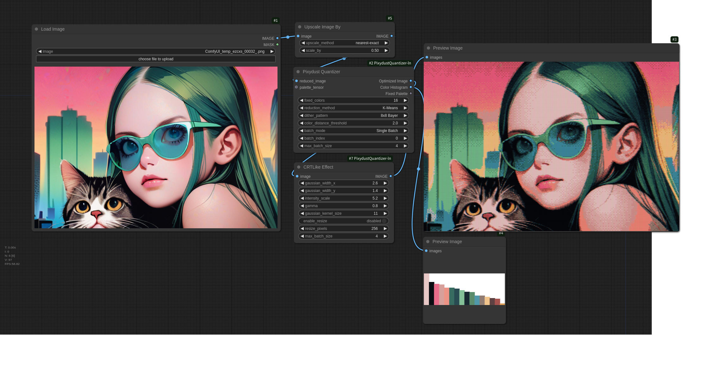

# Pixydust Quantizer for ComfyUI

Pixydust Quantizer is a custom node extension for ComfyUI that allows for the simplified recreation of tile patterns used in 1990s 16-color PC graphics, offering advanced color quantization and palette optimization features.

- Original


- Pixydust Quantizer


- Regular tool  (ImageQuantize)


## Features and Concept

- Simplified recreation of tile patterns used in 1990s 16-color PC graphics
- Prioritizes colors used in large areas of the image (e.g., a character's face) for the palette, preventing unnecessary tile patterning
- Threshold settings to adjust the balance between tile patterns and flat colors
- External palette input function to maintain palette consistency in videos or image sequences
- Control over which colors are tile-patterned, which was difficult with traditional methods

The name "Pixydust" combines "pixy" (as in pixel art) and "dust" (to suggest a grainy look), with an added nuance of a clever, tricky effect, like the magic of fairy dust.

## Installation

1. Navigate to the custom node directory in ComfyUI:
   ```
   cd ComfyUI/custom_nodes/
   ```

2. Clone this repository:
   ```
   git clone https://github.com/yourusername/ComfyUI-Pixydust-Quantizer.git
   ```

3. Install the required dependencies:
   ```
   pip install -r ComfyUI-Pixydust-Quantizer/requirements.txt
   ```

4. Restart ComfyUI

## Usage

### PixydustQuantize1 (Primary Color Reduction Node)

This node reduces the colors of an input image using the specified method and maximum number of colors.

Inputs:
- `image`: Input image
- `color_reduction_method`: Choose from "Pillow Quantize", "K-Means", or "MedianCut"
- `max_colors`: Maximum number of colors after reduction

Outputs:
- `Reduced Color Image`: Image with reduced colors
- `Palette Preview`: Preview of the color palette used
- `Palette Tensor`: Color palette in tensor format

### PixydustQuantize2 (Palette Optimization Node)

This node optimizes the palette of a color-reduced image and applies dithering. It assigns palette colors based on the proportion of each color used in the image to avoid tile patterning in prominent areas like a character’s face.

Inputs:
- `reduced_image`: Input image with reduced colors
- `fixed_colors`: Number of colors in the optimized palette
- `reduction_method`: Choose from "K-Means" or "MedianCut"
- `dither_pattern`: Choose from "None", "2x2 Bayer", "4x4 Bayer", or "8x8 Bayer"
- `color_distance_threshold`: Threshold for using tile patterns
- `palette_tensor` (optional): External palette input for videos

Outputs:
- `Optimized Image`: Image with optimized palette and dithering applied
- `Color Histogram`: Color histogram of the optimized image
- `Fixed Palette`: Optimized color palette in tensor format

## Example Workflow

Here’s a simple workflow example:

1. Load an image
2. Connect the image to the Pixydust Quantize-1
3. Connect the output of the ColorReducerNode to the Pixydust Quantize-2
4. Save or display the resulting optimized image

Note: The processing speed isn't very fast so far. It takes about 10 seconds (depending on the machine's power) to generate a 512x512 pixel image.



## License

This project is licensed under the MIT License - see the [LICENSE](LICENCE.txt) file for details.

## Acknowledgments

- Special thanks to the ComfyUI community for providing the tools and creative motivation!
